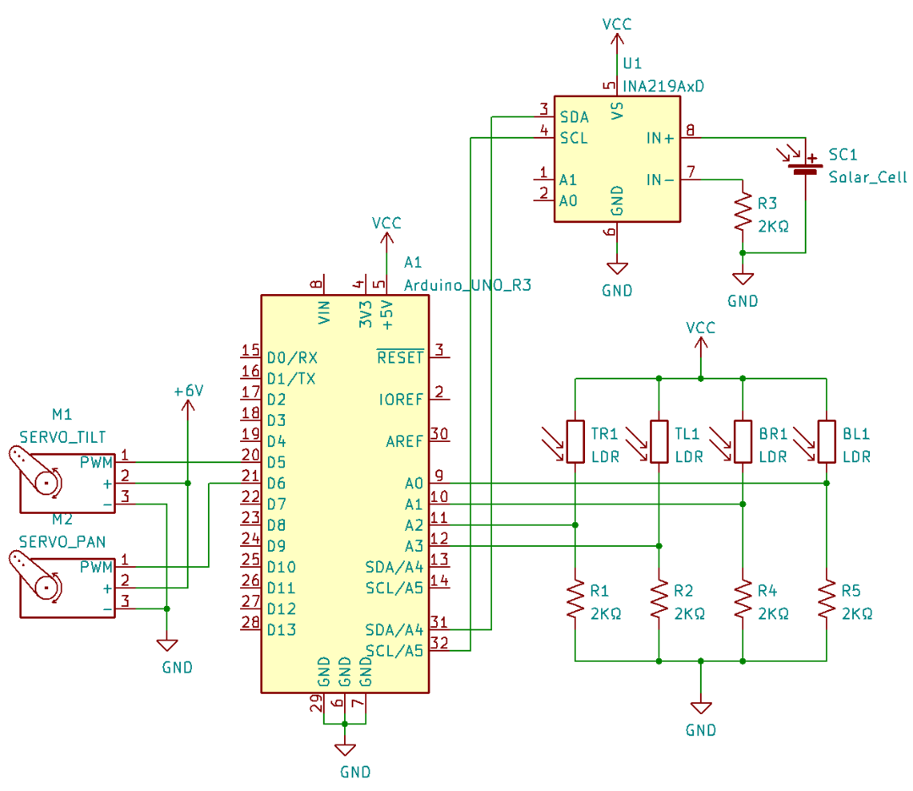
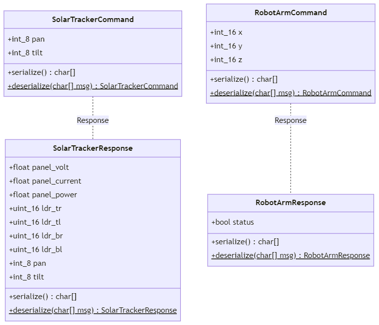

# Analysis of the Optimal Adjustment Frequency for a Dual-Axis Solar Tracker

## Governor’s School of New Jersey Program in Engineering & Technology 2022

### Adham Ibrahim, Nicholas Gibson, Jenna Mullin, Samuel Lihn

This is the main repository for *Analysis of the Optimal Adjustment Frequency for a Dual-Axis Solar Tracker*, published in the New Jersey
Governor's School for Engineering and Technology research journal.

The full paper can be viewed here: _Link not yet available; check back soon._

Details for each submodule can be found in their respective directories.

### Solar Tracker Schematic Diagram

### Transmission Diagram between Arduino and Python

